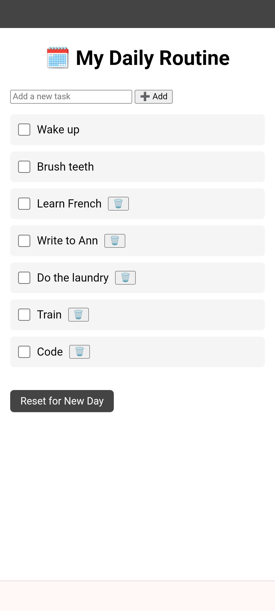

# Routinier 🗓️

**Routinier** is a minimalist daily routine tracker, built to help create structure, focus, and consistency in life.  
It’s perfect for developers, creatives, and anyone designing a better day.

🔗 [Live Demo](https://daily-routine-checker.netlify.app)

---

## ✨ Features
- ✅ Add, edit, and delete routine tasks
- ✅ Works offline (PWA)
- ✅ Mobile-optimized

## 🛠️ Built With
- HTML  
- CSS  
- JavaScript  
- Hosted on Netlify  

## 📸 Screenshot  

---

Built with care by **Savo Kordes** — redesigning life, one habit at a time.
